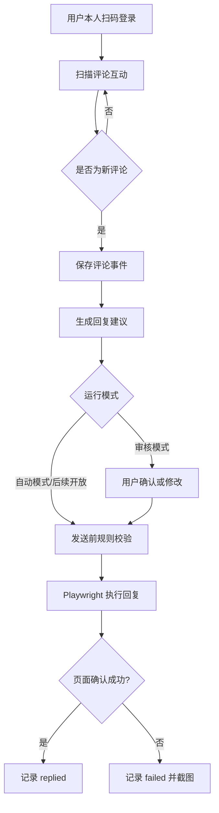
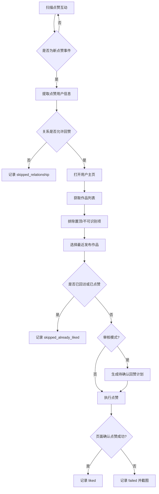

# 礼尚往来：创作者互动助手开发计划

> 项目定位：基于 Playwright 的创作者互动助手。发现真实点赞与评论，辅助回复评论，并对符合规则的好友/互关用户进行作品回访互动。
>
> 开发目标：在不绕过登录、验证码或平台风控的前提下，将重复性的互动管理工作做成可观察、可确认、可追溯的本地工具。

---

## 1. 项目背景

内容创作者发布作品后，会收到评论、点赞等互动。手动逐条查看、筛选好友、进入主页、选择最新作品再回赞，操作重复且容易遗漏。

「礼尚往来」解决的不是批量刷互动问题，而是**真实互动的及时回访**：

- 有人评论我的作品：查看评论内容，生成合适回复，确认后发送；
- 有好友或互关用户点赞我的作品：进入其主页，找到最近发布的作品，在未互动过的情况下回赞一次；
- 所有操作保留日志，避免重复回复、重复回赞，并便于人工复核。

---

## 2. 产品目标与边界

### 2.1 核心目标

1. 读取当前账号可见的评论互动与点赞互动。
2. 对新评论建立“扫描 → 生成回复 → 审核 → 发送 → 记录”的完整流程。
3. 对点赞事件建立“扫描 → 判断好友/互关 → 回访主页 → 选择最近作品 → 回赞 → 记录”的完整流程。
4. 支持本地执行与未来接入 OpenClaw/Agent 调度。
5. 保证所有动作可追踪、可中断、可人工接管。

### 2.2 第一版必须遵守的边界

- 用户本人扫码登录，工具只复用本地浏览器登录态。
- 不绕过验证码、登录校验、滑块验证或任何平台风控。
- 不实现批量刷赞、陌生用户广撒网互动、自动关注、自动私信。
- 点赞回访仅面向用户配置允许的关系类型，第一版默认只允许“好友/互关”。
- 评论自动发送默认关闭；第一版以“生成回复计划 + 人工确认发送”为默认模式。
- 页面出现异常提示、登录失效或选择器无法确定时，停止执行并输出诊断信息，不盲目继续点击。

### 2.3 MVP 不包含的功能

- 手机 App 自动化；
- 云端多账号托管；
- 定时无人值守高频运行；
- 自动涨粉、自动关注、自动私信；
- 内容发布、数据统计大屏、商业化会员系统。

---

## 3. 技术路线判断

### 3.1 参考项目可用基础

现有 `douyin-creator-tools` 采用 Node.js + JavaScript ES Module（`.mjs`）+ Playwright + SQLite 的技术路线，并已经具备：

- 浏览器登录态复用；
- 作品列表读取；
- 指定作品未回复评论导出；
- 根据 JSON 计划批量回复评论；
- 本地数据库与脚本式命令入口的基础模式。

因此本项目第一版无需更换技术栈，可以继续采用：

```text
Node.js 22+
JavaScript ES Module (.mjs)
Playwright
better-sqlite3
可选：Express 本地管理页面
```

### 3.2 关键不确定性

现有项目已证明“创作者中心评论流程”可用，但尚未证明以下链路可以从网页端稳定完成：

1. 能否查看“谁给我的作品点赞了”；
2. 点赞列表是否能识别用户关系，例如好友、互关、已关注；
3. 能否从点赞记录直接进入该用户主页；
4. 网页端主页是否能准确获取最近发布且非置顶的作品；
5. 网页端是否能稳定判断目标作品是否已经点赞。

因此，**开发第一步必须是页面探测，不是直接开发自动回赞**。

### 3.3 源码授权注意事项

参考仓库公开可读，但在启动开发前应单独确认其授权情况。若仓库没有明确开源许可证，不建议直接复制其源码后再对外发布或商用。可以先：

- 仅在本地研究交互流程；
- 自行重写关键模块；
- 或取得作者授权后再基于其代码扩展。

---

## 4. 用户流程

### 4.1 评论回复流程



### 4.2 好友点赞回访流程



---

## 5. MVP 功能需求

### 5.1 登录态管理

**目标：** 用户本人首次登录后，本地复用登录状态。

功能：

- `npm run auth` 打开可视浏览器供用户扫码登录；
- 浏览器 profile 存储于 `.playwright/douyin-profile/`；
- 所有后续脚本统一复用该目录；
- 发现跳转登录页时中止流程并给出重新登录提示；
- 登录态目录加入 `.gitignore`，禁止上传。

验收标准：

- 首次扫码后重新运行脚本不需要重复登录；
- 登录失效时工具不继续执行互动动作；
- 日志中不输出 Cookie、Token 等敏感数据。

### 5.2 页面探测模块（第一优先级）

**目标：** 在未猜测选择器的前提下，确认点赞互动链路是否存在。

新增命令：

```bash
npm run interactions:inspect
```

运行方式：

1. 打开复用登录态的可视浏览器；
2. 默认进入可能的消息/互动页面，若未定位成功，允许用户手动导航到点赞/评论通知区域；
3. 用户在终端按回车后，工具采集当前页面信息；
4. 将诊断结果输出到本地目录。

输出内容：

```text
interactions-output/inspect/<timestamp>/
  page-info.json             # URL、标题、采集时间
  visible-text.txt           # 可见文本摘要
  keyword-elements.json      # 含赞/评论/好友/互关等关键词的元素候选
  clickable-users.json       # 可点击昵称/头像/主页入口候选
  screenshot-full.png        # 整页截图
  dom-fragment.html          # 仅保存必要局部片段，便于定位选择器
```

关键词至少包含：

```text
赞、点赞、评论、回复、好友、朋友、互相关注、关注了你、作品、主页
```

验收标准：

- 能输出人工可阅读的截图与候选节点信息；
- 能确认点赞通知是否在网页端可见；
- 能确定下一阶段所需的页面路径和稳定选择器候选；
- 未确认页面结构前，不实现自动点赞动作。

### 5.3 互动事件扫描

**目标：** 将页面可见的评论和点赞信息转换为统一事件记录。

新增命令：

```bash
npm run interactions:scan -- --type all
npm run interactions:scan -- --type comment
npm run interactions:scan -- --type like
```

统一事件字段：

```json
{
  "platform": "douyin",
  "eventType": "comment | like",
  "actorName": "用户名",
  "actorProfileKey": "可稳定识别用户的字段或主页地址",
  "relation": "friend | mutual | following | stranger | unknown",
  "myWorkTitle": "被互动的我的作品标题",
  "content": "评论文字；点赞事件为空",
  "eventTimeText": "页面上显示的时间文本",
  "sourceFingerprint": "用于去重的指纹",
  "status": "new"
}
```

去重策略：

- 优先使用页面可获取的唯一事件标识；
- 无唯一标识时，对 `eventType + actorProfileKey + myWorkTitle + content + eventTimeText` 生成哈希；
- 同一指纹重复扫描时不创建新任务。

验收标准：

- 扫描两次同一页面不会重复创建事件；
- 评论与点赞能够以统一格式落库；
- 无法判断关系时标记 `unknown`，不得默认当作好友。

### 5.4 评论回复计划与执行

**目标：** 对所有新评论提供回复能力，第一版默认人工审核。

新增命令：

```bash
npm run comments:scan
npm run comments:plan -- --mode manual
npm run comments:reply -- --plan ./data/plans/comments-plan.json
```

回复策略：

- 支持模式：`manual`（默认）与 `auto`（预留，不默认启用）；
- 无意义表情或纯点赞型评论也可以生成短回复，但允许用户跳过；
- 涉及争议、投诉、攻击、敏感问题时默认标记人工处理；
- 回复最多 400 字符；
- 发送前再次确认原评论仍存在且未回复；
- 点击发送后必须通过页面状态变化或重新扫描确认成功，不能只以“按钮点击成功”作为结果。

评论计划示例：

```json
{
  "mode": "manual",
  "createdAt": "2026-05-28T00:00:00+09:00",
  "items": [
    {
      "eventId": 1,
      "actorName": "示例用户",
      "commentText": "这个怎么安装？",
      "replyText": "我后面会单独整理安装流程，你用的是 Windows 还是 Mac？",
      "approved": false
    }
  ]
}
```

验收标准：

- 仅 `approved: true` 的项目可执行发送；
- 回复成功、失败、跳过均落库；
- 失败时保留截图和页面文本，支持人工复核；
- 重复执行同一计划不会重复回复。

### 5.5 点赞回访计划与执行

**目标：** 当允许关系的用户点赞我的作品后，回访其最近发布作品并回赞一次。

新增命令：

```bash
npm run likes:scan
npm run likes:plan -- --relation friend,mutual
npm run likes:reciprocate -- --plan ./data/plans/likes-plan.json
```

处理规则：

1. 只处理新点赞事件；
2. 默认允许关系：`friend`、`mutual`；
3. `unknown`、`stranger` 默认跳过；
4. 进入目标用户主页后，获取可见作品列表；
5. 识别并排除置顶作品，优先选择发布时间最近的非置顶作品；
6. 若无法准确判断发布时间，则生成待审核计划，不自动点击；
7. 若目标作品已经点过赞或已执行过回访，则跳过；
8. 动作完成后重新读取点赞按钮状态确认成功。

点赞计划示例：

```json
{
  "mode": "manual",
  "relationAllowlist": ["friend", "mutual"],
  "items": [
    {
      "eventId": 22,
      "actorName": "示例好友",
      "relation": "mutual",
      "profileUrl": "页面解析得到的主页地址",
      "targetVideoUrl": "页面解析得到的作品地址",
      "targetVideoTitle": "最近作品标题",
      "selectionReason": "最新非置顶作品",
      "approved": false
    }
  ]
}
```

验收标准：

- 非允许关系不会执行点赞；
- 无法确定“最新非置顶作品”时不自动执行；
- 同一用户同一目标作品不会重复回赞；
- 页面动作前后均有状态检查与日志记录。

### 5.6 运行记录与本地管理

第一版至少提供 JSON 日志和 SQLite 查询命令：

```bash
npm run history -- --type all
npm run history -- --type comment
npm run history -- --type like
npm run history -- --status failed
```

第二阶段可增加本地管理页：

```bash
npm run server
# 浏览器访问本地端口，查看待处理/成功/失败记录
```

本地管理页最少包含：

- 待回复评论列表；
- 待回赞好友列表；
- 审核按钮；
- 执行结果与失败截图入口；
- 运行设置：审核模式、允许关系、每批最大处理数。

---

## 6. 技术架构

### 6.1 总体架构

```text
CLI / 本地管理页 / 后续 OpenClaw Skill
                 │
                 ▼
          Application Services
   ┌─────────────┴─────────────┐
   │                           │
Comment Workflow          Like Reciprocity Workflow
   │                           │
   └─────────────┬─────────────┘
                 ▼
          Playwright Adapters
  登录态 / 互动页 / 主页 / 作品页 / 动作确认
                 │
                 ▼
          SQLite + 文件输出
  事件、计划、执行动作、截图、错误诊断
```

### 6.2 推荐目录结构

```text
li-shang-wang-lai/
  package.json
  README.md
  DEVELOPMENT_PLAN.md
  .gitignore
  .env.example
  src/
    auth-douyin.mjs
    cli/
      inspect-interactions.mjs
      scan-interactions.mjs
      plan-comments.mjs
      execute-comment-replies.mjs
      plan-likes.mjs
      execute-reciprocal-likes.mjs
      show-history.mjs
    browser/
      browser-context.mjs
      login-guard.mjs
      page-diagnostics.mjs
    adapters/
      interaction-page.mjs
      comment-page.mjs
      notification-page.mjs
      user-profile-page.mjs
      video-page.mjs
      selectors.mjs
    workflows/
      comment-reply-workflow.mjs
      like-reciprocity-workflow.mjs
    domain/
      event-fingerprint.mjs
      relationship-policy.mjs
      latest-work-selector.mjs
      action-policy.mjs
    db/
      database.mjs
      migrations.mjs
      interaction-repository.mjs
      action-repository.mjs
      plan-repository.mjs
    config/
      defaults.mjs
      user-config.mjs
    utils/
      logger.mjs
      filesystem.mjs
      wait.mjs
  data/
    .gitkeep
  interactions-output/
    .gitkeep
  .playwright/
    .gitkeep
  tests/
    unit/
    fixtures/
```

### 6.3 为什么要拆适配层

抖音页面会变，选择器是整个工具最不稳定的部分。不能把页面选择器、业务判断和数据库写在一个脚本里。

建议约束：

- `adapters/` 只负责读取页面与执行页面动作；
- `workflows/` 只负责编排业务流程；
- `domain/` 负责“是否允许回赞”“如何选最近作品”等规则；
- `db/` 负责持久化；
- 页面改版时尽量只改 `adapters/` 和 `selectors.mjs`。

---

## 7. 配置设计

配置文件建议为 `config/local.json`，加入 `.gitignore`；仓库只提交示例配置 `config/example.json`。

```json
{
  "browser": {
    "headless": false,
    "profileDir": ".playwright/douyin-profile",
    "slowMo": 150
  },
  "comments": {
    "enabled": true,
    "mode": "manual",
    "maxPerRun": 10,
    "maxReplyLength": 400
  },
  "likes": {
    "enabled": true,
    "mode": "manual",
    "allowedRelations": ["friend", "mutual"],
    "maxPerRun": 5,
    "skipPinned": true,
    "requireLatestWorkConfirmed": true
  },
  "safety": {
    "stopOnLoginRequired": true,
    "stopOnCaptcha": true,
    "captureScreenshotOnAction": true,
    "captureScreenshotOnFailure": true
  }
}
```

说明：`maxPerRun` 是避免误操作的产品限额，不用于规避平台检测。

---

## 8. 数据库设计

使用 SQLite，数据库文件默认：

```text
data/lishangwanglai.db
```

### 8.1 互动事件表 `interaction_events`

```sql
CREATE TABLE interaction_events (
  id INTEGER PRIMARY KEY AUTOINCREMENT,
  platform TEXT NOT NULL DEFAULT 'douyin',
  event_type TEXT NOT NULL CHECK (event_type IN ('comment', 'like')),
  actor_name TEXT NOT NULL,
  actor_profile_key TEXT,
  actor_profile_url TEXT,
  relation TEXT NOT NULL DEFAULT 'unknown',
  my_work_title TEXT,
  comment_text TEXT,
  event_time_text TEXT,
  fingerprint TEXT NOT NULL UNIQUE,
  raw_payload_json TEXT,
  status TEXT NOT NULL DEFAULT 'new',
  scanned_at TEXT NOT NULL,
  created_at TEXT NOT NULL DEFAULT CURRENT_TIMESTAMP,
  updated_at TEXT NOT NULL DEFAULT CURRENT_TIMESTAMP
);
```

### 8.2 处理计划表 `action_plans`

```sql
CREATE TABLE action_plans (
  id INTEGER PRIMARY KEY AUTOINCREMENT,
  plan_type TEXT NOT NULL CHECK (plan_type IN ('comment_reply', 'reciprocal_like')),
  mode TEXT NOT NULL CHECK (mode IN ('manual', 'auto')),
  status TEXT NOT NULL DEFAULT 'draft',
  payload_json TEXT NOT NULL,
  created_at TEXT NOT NULL DEFAULT CURRENT_TIMESTAMP,
  approved_at TEXT,
  executed_at TEXT
);
```

### 8.3 行为记录表 `actions`

```sql
CREATE TABLE actions (
  id INTEGER PRIMARY KEY AUTOINCREMENT,
  event_id INTEGER NOT NULL,
  plan_id INTEGER,
  action_type TEXT NOT NULL CHECK (action_type IN ('reply_comment', 'like_work', 'skip')),
  target_url TEXT,
  target_title TEXT,
  action_text TEXT,
  status TEXT NOT NULL CHECK (status IN ('planned', 'approved', 'running', 'succeeded', 'failed', 'skipped')),
  reason TEXT,
  evidence_json TEXT,
  screenshot_path TEXT,
  created_at TEXT NOT NULL DEFAULT CURRENT_TIMESTAMP,
  executed_at TEXT,
  FOREIGN KEY(event_id) REFERENCES interaction_events(id),
  FOREIGN KEY(plan_id) REFERENCES action_plans(id)
);
```

### 8.4 回赞唯一约束建议

为避免重复回赞，可额外创建唯一索引：

```sql
CREATE UNIQUE INDEX idx_unique_success_like_target
ON actions(action_type, target_url)
WHERE action_type = 'like_work' AND status = 'succeeded';
```

如后续策略需要允许同一用户不同作品分别互动，可基于 `target_url` 唯一控制，不按用户永久屏蔽。

---

## 9. CLI 命令设计

### 9.1 初始化与诊断

```json
{
  "scripts": {
    "auth": "node ./src/auth-douyin.mjs",
    "interactions:inspect": "node ./src/cli/inspect-interactions.mjs",
    "db:init": "node ./src/db/migrations.mjs"
  }
}
```

### 9.2 业务命令

```json
{
  "scripts": {
    "interactions:scan": "node ./src/cli/scan-interactions.mjs",
    "comments:plan": "node ./src/cli/plan-comments.mjs",
    "comments:reply": "node ./src/cli/execute-comment-replies.mjs",
    "likes:plan": "node ./src/cli/plan-likes.mjs",
    "likes:reciprocate": "node ./src/cli/execute-reciprocal-likes.mjs",
    "history": "node ./src/cli/show-history.mjs"
  }
}
```

使用示例：

```bash
npm run interactions:inspect
npm run interactions:scan -- --type all
npm run comments:plan -- --mode manual
npm run comments:reply -- --plan-id 1
npm run likes:plan -- --relation friend,mutual --mode manual
npm run likes:reciprocate -- --plan-id 2
npm run history -- --status failed
```

---

## 10. 页面自动化实现原则

### 10.1 选择器策略

选择器优先级从高到低：

1. 稳定语义属性：`role`、可访问名称、明确业务文本；
2. 页面自带的稳定属性：如 `data-*`、业务标识属性；
3. DOM 层级组合定位；
4. 动态 class 名只作为最后兜底，不作为唯一依据。

禁止做法：

- 未通过探测就硬编码一批猜测选择器；
- 使用全局第一个按钮直接点击；
- 不检查对象是谁、作品是哪条就执行互动。

### 10.2 动作确认原则

所有写动作必须符合：

```text
执行前校验目标对象
→ 截取必要证据
→ 点击/输入
→ 等待页面响应
→ 再读取状态确认成功
→ 写入数据库
```

例如点赞不能只判断 `click()` 没报错，而要观察按钮状态、点赞图标状态或页面可验证的变化。

### 10.3 异常处理

以下情形立即中止当前批次：

- 页面跳转至登录页；
- 页面出现验证码、滑块、异常验证或操作受限提示；
- 关键选择器匹配多个不确定目标；
- 作品最新排序无法可靠判断；
- 连续动作失败超过配置阈值。

中止时输出：

```text
错误类型
当前 URL
步骤名称
页面截图
关键文本摘要
建议人工操作说明
```

---

## 11. 最近作品选择规则

回赞链路最容易出现误操作的地方是“最近作品”识别。

### 11.1 正确处理逻辑

1. 打开好友主页；
2. 获取当前可见作品卡片及其置顶标记、作品链接、标题、时间文本；
3. 若存在明确置顶标记，将置顶作品从“最新作品候选”中排除；
4. 若页面有可靠发布时间，按时间降序选择最近一条；
5. 若无时间、仅按网格顺序显示，第一版不自动点赞，只生成待人工确认的计划；
6. 打开选中作品，确认当前账号没有点过赞，再执行回赞。

### 11.2 不接受的简单实现

```text
进入主页后直接点击第一个视频并点赞
```

原因：第一个视频可能是置顶旧作品，无法代表用户最近发布内容。

---

## 12. 评论回复策略

### 12.1 第一版执行模式

默认：`manual`。

```text
扫描评论 → 生成回复计划 JSON → 用户确认 approved → 自动填写并发送
```

### 12.2 回复内容分类

| 分类 | 示例 | 处理原则 |
|---|---|---|
| 支持/夸赞 | “太强了” | 简短、自然地回应 |
| 求教程 | “怎么安装？” | 回一个关键追问或说明后续安排 |
| 技术问题 | “Windows 能跑吗？” | 给明确但短的答案 |
| 质疑 | “这是不是假的？” | 提供依据，不争吵 |
| 攻击/敏感 | 人身攻击、违规话题 | 默认不自动回，交给人工 |

### 12.3 AI 接入预留

第一版可以先把回复内容写死或人工录入，确保自动化链路稳定。AI 生成回复作为独立服务层接入：

```text
CommentEvent → ReplyGenerator → ReplyDraft → HumanApproval → PlaywrightExecutor
```

接口示例：

```js
export async function generateReplyDraft(commentEvent, creatorStyleConfig) {
  return {
    text: '...',
    riskLevel: 'low | review | block',
    reason: '...'
  };
}
```

---

## 13. 开发里程碑与任务拆解

## 阶段 0：项目初始化与版权边界确认

**目标：** 建立独立项目骨架，明确哪些代码能复用，避免后期重构和授权风险。

任务：

- 创建新项目 `li-shang-wang-lai`；
- 初始化 Node.js 22 + ESM + Playwright + better-sqlite3；
- 配置 ESLint、Prettier、`.gitignore`；
- 编写 `README.md`，声明产品边界；
- 确认参考仓库是否有可用于二开/分发的许可；
- 若未获许可，仅参考功能和交互，不直接复制源码实现。

交付物：

- 可运行空项目；
- `npm run lint` 与 `npm run format:check` 可执行；
- 数据目录、浏览器登录态目录不会被 Git 提交。

验收：

- `node -v` 使用 Node 22+；
- `npm install` 与 `npx playwright install chromium` 成功；
- Git 仓库无登录态、数据库或截图隐私文件。

---

## 阶段 1：登录态与互动页面探测（P0，必须先完成）

**目标：** 证明网页端能否支持点赞回访链路。

任务：

- 实现 `npm run auth`；
- 实现 `browser-context.mjs`，统一复用 profile；
- 实现 `login-guard.mjs`；
- 实现 `npm run interactions:inspect`；
- 保存页面截图、文本、候选点击入口；
- 人工确认点赞通知页、关系标识和主页入口。

交付物：

- 一份真实登录态下的页面探测输出；
- `docs/page-findings.md`：记录已确认页面路径、元素语义、选择器候选与未知项。

验收：

- 可从脚本打开登录后的页面；
- 能导出互动页诊断包；
- 最终得到明确结论：网页端可以做点赞链路，或需改用手机自动化/调整范围。

**决策门：** 如果网页端拿不到点赞用户清单或主页入口，则暂停“点赞回访”开发，只保留评论模块，另行评估移动端方案。

---

## 阶段 2：数据库与事件扫描

**目标：** 将评论/点赞转换为可去重、可追踪的事件数据。

任务：

- 初始化 SQLite 表结构；
- 实现事件指纹生成；
- 实现互动列表读取适配器；
- 实现 `interactions:scan -- --type comment/like/all`；
- 写入事件、处理重复事件、输出扫描结果 JSON。

交付物：

- SQLite 数据库迁移脚本；
- 扫描命令；
- 样例输出文件。

验收：

- 相同页面重复扫描无重复事件；
- 页面读取失败时不写错误数据；
- 可以查询本次扫描新增多少评论/点赞事件。

---

## 阶段 3：评论回复闭环

**目标：** 先把成熟度较高的评论模块完整跑通。

任务：

- 根据新评论生成待回复计划；
- 支持人工修改 `replyText` 和 `approved` 状态；
- 实现发送前原评论复核；
- 实现回复动作与发送结果确认；
- 记录成功、失败、跳过结果；
- 失败自动截图。

交付物：

- `comments:plan`；
- `comments:reply`；
- 评论处理历史查询。

验收：

- 以 2 至 3 条测试评论完成端到端验证；
- 未审批项绝不发送；
- 重复执行计划不会产生重复回复；
- 成功状态依据页面确认，而不是仅依据点击动作。

---

## 阶段 4：点赞好友回访闭环

**目标：** 处理符合规则的点赞回访任务。

前置条件：阶段 1 已确认网页端链路可操作。

任务：

- 读取点赞事件和用户关系；
- 仅对允许关系生成计划；
- 实现主页访问与作品卡片采集；
- 实现置顶作品排除；
- 实现最新作品确认规则；
- 实现是否已点赞检测；
- 支持人工审核后执行回赞；
- 动作确认与日志记录。

交付物：

- `likes:plan`；
- `likes:reciprocate`；
- 失败诊断截图和历史查询。

验收：

- 仅好友/互关进入计划；
- 置顶作品不会被误认为最新作品；
- 不重复给同一目标视频回赞；
- 无法确定目标时自动跳过并等待人工处理。

---

## 阶段 5：本地审核面板

**目标：** 把修改 JSON 的流程升级为可视化审核。

任务：

- 使用 Express 构建本地页面；
- 展示待处理评论和点赞计划；
- 支持编辑回复文案、勾选审批、执行选中动作；
- 查看成功/失败/跳过记录及截图；
- 配置允许关系和单批处理上限。

交付物：

- 本地管理页面；
- 操作审计日志；
- 基础配置管理。

验收：

- 用户无需直接编辑 JSON 即可完成审核；
- 页面仅监听本地地址；
- 关键动作需要显式点击确认。

---

## 阶段 6：Agent/OpenClaw 接入与稳定性优化

**目标：** 让 Agent 负责读取任务、生成回复计划，但保持写动作可控。

任务：

- 编写 skill 文档；
- 将“扫描互动”“生成回复草稿”“读取历史”开放给 Agent；
- 执行点赞/回复前默认要求用户确认；
- 增加页面改版后的探测与诊断流程；
- 增加可回归测试的页面 fixture。

交付物：

- `skills/li-shang-wang-lai/SKILL.md`；
- Agent 使用示例；
- 稳定性测试清单。

验收：

- Agent 不替用户登录；
- Agent 不绕过审核执行高风险动作；
- 页面异常时能够输出可定位问题的信息。

---

## 14. 迭代优先级

| 优先级 | 能力 | 原因 |
|---|---|---|
| P0 | 登录态、页面探测、截图诊断 | 不确认页面能力，后续回赞都可能白做 |
| P0 | 本地数据库与去重 | 避免重复回复/回赞 |
| P1 | 评论扫描与人工审核回复 | 链路已有参考，更容易先跑通 |
| P1 | 好友点赞扫描与回赞计划 | 是项目核心差异能力 |
| P2 | 自动回赞执行 | 必须建立在可靠识别和审核基础上 |
| P2 | 本地审核面板 | 提升可用性 |
| P3 | AI 自动生成回复 | 不是自动化链路的前置条件 |
| P3 | OpenClaw Skill | 核心流程稳定后再接入 |

---

## 15. 测试计划

### 15.1 单元测试

重点测试纯业务规则，不依赖真实页面：

- 事件指纹是否稳定；
- 关系白名单判定；
- 置顶作品过滤规则；
- 最近作品排序规则；
- 回复长度限制；
- 计划审批状态判断；
- 重复回赞拦截逻辑。

### 15.2 页面适配测试

使用探测阶段保存的脱敏 DOM fixture：

- 互动列表解析；
- 用户入口解析；
- 关系文本解析；
- 主页作品卡片解析；
- 点赞按钮状态解析；
- 评论发送结果解析。

### 15.3 人工端到端测试

测试账号/真实账号低量验证顺序：

1. 登录态保存与失效处理；
2. 扫描一条评论但不发送；
3. 审核后回复一条评论；
4. 扫描一次点赞事件但不回赞；
5. 对一个已确认好友执行一次回赞；
6. 重复运行并验证不会重复动作；
7. 模拟页面缺失元素、登录失效、异常验证，验证安全停止。

### 15.4 发布前验收清单

- [ ] 默认运行模式为审核模式；
- [ ] 登录态和数据库已排除在 Git 之外；
- [ ] 评论发送结果有页面确认；
- [ ] 点赞结果有页面确认；
- [ ] 非好友/互关默认不回赞；
- [ ] 置顶作品不会直接作为最新作品处理；
- [ ] 失败场景有日志和截图；
- [ ] 不包含绕过验证码或平台限制的实现；
- [ ] 对外发布前确认参考源码授权问题。

---

## 16. 开发执行顺序（给 Codex 的任务拆分）

不要一次让 Codex 把所有功能写完。按以下任务逐次提交，每一步都运行并核验产物。

### Task 1：创建新项目骨架

目标：初始化项目结构、依赖、配置和数据库迁移空框架。

要求：

- Node.js ESM；
- 添加 Playwright 与 better-sqlite3；
- 添加 ESLint/Prettier；
- 设置 `.gitignore`；
- 创建上述目录结构；
- 不实现任何点赞/回复动作。

### Task 2：实现登录与页面探测

目标：能复用登录态，手动打开互动页面后导出诊断包。

要求：

- 可视浏览器；
- 不猜测自动点击路径；
- 导出截图、页面 URL、关键词节点信息；
- 遇到登录页立即终止。

### Task 3：根据真实探测结果实现互动读取

目标：只实现读操作，保存评论/点赞事件。

要求：

- 选择器必须来自真实探测结果；
- 实现 SQLite 落库与去重；
- 不执行点赞、回复。

### Task 4：实现评论审核与发送闭环

目标：评论模块端到端可使用。

要求：

- 仅处理审批后的计划；
- 发送前复核；
- 发送后确认；
- 失败输出截图。

### Task 5：实现好友回赞计划生成

目标：生成计划，不执行点赞。

要求：

- 仅好友/互关；
- 提取主页及目标作品；
- 排除置顶；
- 不确定就标记需人工确认。

### Task 6：实现审批后的点赞执行

目标：执行已审批的少量回赞任务。

要求：

- 每批最大执行数量受配置限制；
- 执行前检查目标与已点赞状态；
- 执行后验证结果；
- 防重复。

### Task 7：增加本地审核页与 Agent 能力

目标：提高实际使用体验。

要求：

- 先做本地面板，再写 skill；
- Agent 默认只做读取与生成计划；
- 写动作保留确认步骤。

---

## 17. 第一条可直接交给 Codex 的开发指令

```text
我要新建一个项目，项目名为“礼尚往来”（li-shang-wang-lai），它是一个基于 Playwright 的创作者互动助手。

背景：我参考过 douyin-creator-tools 项目的技术路线，但当前项目需要独立实现，不要直接复制第三方仓库源码。技术栈使用 Node.js 22、JavaScript ES Module（.mjs）、Playwright、better-sqlite3。

当前只做第一阶段，不要实现自动回复和自动点赞。

第一阶段目标：
1. 初始化项目目录、package.json、eslint、prettier、gitignore。
2. 实现 npm run auth：打开可视 Chromium，使用 .playwright/douyin-profile 保存登录态，由我本人扫码登录。
3. 实现 npm run interactions:inspect：复用登录态打开浏览器，允许我手动导航至包含点赞或评论通知的页面；我在终端确认后，脚本采集当前页面信息。
4. 输出 interactions-output/inspect/<timestamp>/ 目录，包含：
   - page-info.json：URL、页面标题、采集时间；
   - visible-text.txt：可见文本；
   - keyword-elements.json：包含“赞、点赞、评论、回复、好友、朋友、互关、关注、主页”等关键词的元素候选与文本；
   - clickable-users.json：疑似头像、昵称、用户主页入口等可点击候选；
   - screenshot-full.png：页面整页截图。
5. 实现登录保护：检测到登录页面、验证码、风控提示时终止并提示人工处理。
6. 不要臆测点赞页面的选择器，不要执行任何写操作，不要实现自动点赞/自动回复。
7. 提供 README，写清安装、扫码登录、运行页面探测命令和输出文件说明。

完成后，请列出新增文件、每个文件的职责、运行命令，以及我应该如何手工验证探测结果。
```

---

## 18. 成功标准

第一版不是看“能自动点多少赞”，而是看以下目标能否可靠实现：

1. 用户能看到新的评论与点赞互动；
2. 评论可以在审核后准确回复，且不重复；
3. 只有允许的好友/互关点赞事件会进入回访流程；
4. 回赞只落在确认过的最近非置顶作品上；
5. 所有执行均有记录，失败可以定位；
6. 页面变化或平台验证出现时，工具宁可停止，也不误操作。

做到这些，「礼尚往来」才真正是一个能长期使用的创作者互动助手，而不是一段容易失控的点击脚本。
